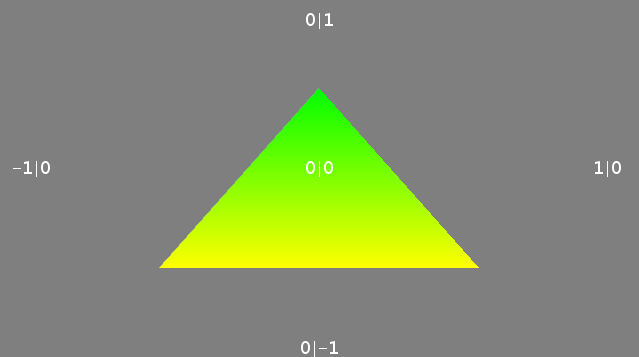
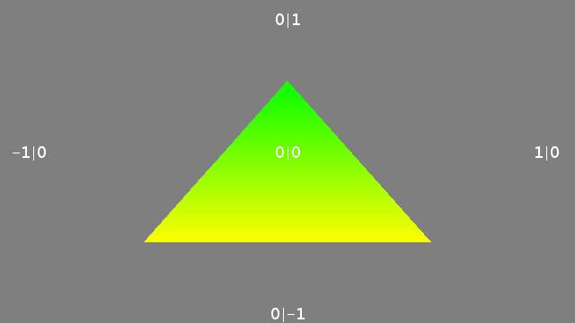

<!-- TABLE OF CONTENTS -->
<details open="open">
  <summary>Tabla de contenidos</summary>
  <ol>
    <li>
      <a href="#Autor">Autor</a>
    </li>
    <li>
      <a href="#Trabajo realizado">Trabajo realizado</a>
    </li>
    <li><a href="#decisiones-adoptadas">Decisiones adoptadas</a></li>
    <li><a href="#referencias">Referencias</a></li>
    <li><a href="#referencias">Herramientas</a></li>
    <li><a href="#problemas-a-resolver">Herramientas</a></li>
    <li><a href="#resultado">Resultado</a></li>
  </ol>
</details>


## Autor

El autor de este proyecto es el estudiante Alejandro Daniel Herrera Cárdenes para la asignatura Creando Interfaces de Usuario (CIU) para el profesor Modesto Fernando Castrillón Santana. 


## Trabajo realizado

El trabajo se basa en conocer y entender el uso de los shaders, esta vez usando el shader de vértices realizando un triángulo pudiéndolo deformar con el ratón.

## Decisiones adoptadas

Las mayores decisiones tomadas y las que mas pruebas requirieron fue ajustar el shader de vértices con la creación del triángulo


* Método que permite crear los planetas con forma de esfera que luego permitirá cargar las imágenes con la función setTexture().
  ```
  void draw() {
    off=norm( mouseX, 0, width );
 
    shader(shdr);
 
    t = createShape();
    t.beginShape();
    t.vertex( 0.0+off, 0.5, 0.0f, 0.0f, 1.0f );   
    t.vertex( 0.5f, -0.5f, 0.0f,  1.0f, 1.0f );   
    t.vertex(-0.5f, -0.5f, 0.0f, 1.0f, 1.0f );   
    t.endShape();
  
    pushMatrix();
    shape(t, 0, 0);
    popMatrix();
 
    resetShader();
  }
 <p align="center"></br>Pantalla final</p>
 


## Referencias

Para ayudarme en la realización de esta aplicación usé básicamente la API que te proporciona [Processing](https://www.processing.org/) además de entender un poco los shaders con [The Book of Shaders](https://thebookofshaders.com/)

* [Documentación de clase](https://ncvt-aep.ulpgc.es/cv/ulpgctp21/pluginfile.php/412240/mod_resource/content/40/CIU_Pr_cticas.pdf).

* [Processing](https://www.processing.org/)

* [The Book of Shaders](https://thebookofshaders.com/)

## Problemas a resolver
## Resultado

Añado un GIF con el resultado de la aplicación final.

  * Resultado
  <p align="center"></br>Gif resultado final</p>
